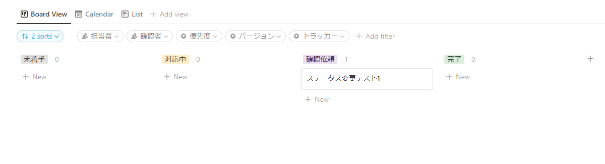

# Notion-Watch-Task-Notification-discord

以下のタスクを監視して、discordで通知を行うbot

ベースのソースコードは [Notion-Task-Watch](https://github.com/ayutaz/Notion-Task-Watch)です。

# what can it do?

- [x] Notionで完了以外のいずれかのステータスで期限まであと3日まで迫っているタスクをdiscordで全体通知

discordでの通知メッセージは以下のようになります。

```
@ようさん cc @ようさん 
タスク名: テスト
期日：2022-05-11
タスクの残り期日が3日以内です。
作業の進捗を確認して、期日以内の完了が難しければ ようさんに相談してください。
```

- [ ] Notionでタスクのステータスが確認待ちから対応中に変更された際に担当者へ、確認依頼に変更された際に確認者へdiscordにタスク名を通知

実装に関する記事

* [Notionのタスク 一覧でタスクがDoneになったときに完了日付を自動入力する【Notion,Python,GitHub Actions】](https://ayousanz.hatenadiary.jp/entry/Notion%E3%81%AE%E3%82%BF%E3%82%B9%E3%82%AF_%E4%B8%80%E8%A6%A7%E3%81%A7%E3%82%BF%E3%82%B9%E3%82%AF%E3%81%8CDone%E3%81%AB%E3%81%AA%E3%81%A3%E3%81%9F%E3%81%A8%E3%81%8D%E3%81%AB%E5%AE%8C%E4%BA%86%E6%97%A5%E4%BB%98)

# requirements

* Python 3.9
* [notion-client](https://github.com/ramnes/notion-sdk-py) :for python notion api wrapper

# setup

1. fork this repository

## Notion set up

2. get notion api
3. get notion db url

## discord set up

4. get discord webhook url

## gitHub set up

5. create db for notion name - discord id.
   Create a DB with the following dictionary type, in which the Notion display name and the discordID are linked.

```
USERS={"userName":"discord User ID"}
```

6. set gitHub action secret for values

Finally, the environment variables are set as follows.

```
NOTION_TOKEN='notion token'
DB='notion db id'
DISCORD_WEBHOOK='discord webhook url'
DEADLINE_LIMIT_DAYS= deadline limit days(int)
USERS={"userName":"discord User ID"}
CONFIRM_USER='user name'
```

そのほかの情報として、NotionのDBは以下の画像ように設定する必要があります。しかし、すべての情報が必要ではありません。
このプログラムを動かすためには、`担当者`、`確認者` 、`期日` 、`preStatus`があれば動きます。
( `preStatus` は内部処理用の疑似的な変数として使っています)

For other information, Notion's DB must be set up as shown in the following image. However, not all information is required.
To run this program, all you need is the `person in charge`, `confirmation person`, `due date`, and `preStatus`.
(I use `preStatus` as a pseudo variable for internal processing)
